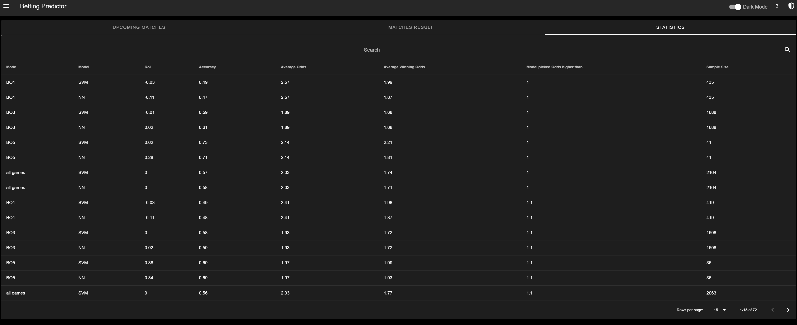
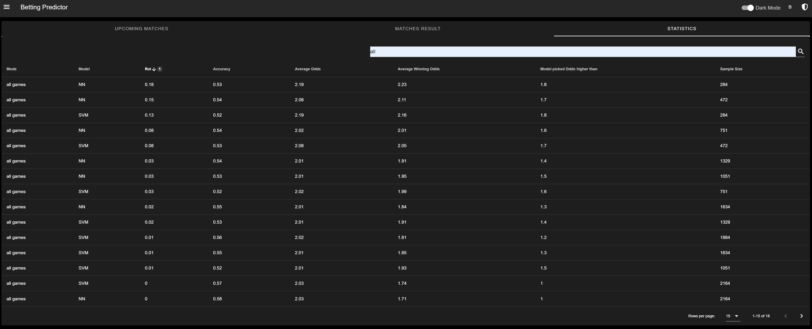

# BettingPrediction
This project focuses on solving the classification Problem of what team wins 
in a competitive e-sports matches. Dota2 and CSGO were analyzed.

## Folder structure
- [BettingFrontend](./BettingFrontend): A frontend to visualize data from 
predictions and evaluation of the data.
- [BettingRestAPI](./BettingRestAPI): A rest api to gather matches continuously
and evaluate the prediction results
- [CSGO Data Analysis](./CSGO%20Data%20Analysis): Includes a scrapy crawler 
to crawl data from [hltv.org](https://www.hltv.org/), store it in csv files 
and evaluate it with a svm model and a tensorflow model implemented with keras.
- [DotaDataAnalysis](./DotaDataAnalysis): Includes a scrapy crawler to crawl
data from [https://api.opendota.com/api/proMatches](https://api.opendota.com/api/proMatches)
, store it in csv files and evaluate it with a svm model.

## CSGO Evaluation
I have gathered data from csgo matches from the last four years which resulted
in a sample of around 60k matches. Each match consists of two teams playing vs each other.
Each team has five players and each player has five statistics about his playing style.
I have restricted the stats to death per round, Kast, average damage per round, 
kills per round and his rating.   
The target is to predict the outcome of a match given its players. So I used 
the player stats as features and the outcome of the match as labels (0 and 1).
Given this thoughts each model takes 5 (Players) * 5 (Player stats) * 2 (Teams)
as input and predict the match output.  
I have evaluated different models and it seems like a svm with a poly kernel 
and a degree of 10 gets the best results for machine learning model. 
As neuronal network a simple model of one input layer, two hidden layers and 
one output layer works quite good. The described SVM achieved an accuracy 
of 69% on 48k training data sample and 12k test data samples. The neuronal 
network achieved 71% accuracy on the same samples. 

## CSGO Evaluation Recent Matches
After the results on all pro matches that I have gathered I want to evaluate 
the model results on recent pro matches and see if it can actually make money by 
betting on the predicted matches. I have build a frontend and backend for that reason.
A scrapy crawler is crawling recent matches with its betting odds, on these matches are predictions made and 
finally evaluated with the actual match outcome.  
  
As you can see not all bets are profitable. It looks like the neuronal network works really good on best of 3 
games since the roi is 2% on 1688 games.  
  
If we filter all games and restrict the results by picked odds higher than a certain threshold an higher roi 
can be achieved. In this examples the neuronal network could make about 8% roi when we filter bets that 
has higher odds than 1.6 from picked games by the model. In absolute numbers that mean the model could achieve 
about 60 buy ins.

## Getting Started
1.Install node modules in the frontend
```
cd BettingFrontend && npm i
```
2.Run the frontend
````
cd BettingFrontend && npm run serve
````
3.Install python modules
````
cd BettingRestAPI && pip install -r requirements.txt
````
4.Run the django server
````
cd BettingRestAPI && python manage.py runserver
````
5.Or run with docker
````
docker-compose up -d --build
````
6.(Optional) Load sample data
````
cd BettingRestAPI && python manage.py loaddata db_prod.json
````

## Tests
````
pyhton manage.py test
````

## Documentation of Rest Api
Go to 
````
http://localhost:8000/swagger
````
or 
````
http://localhost:8000/redoc
````
